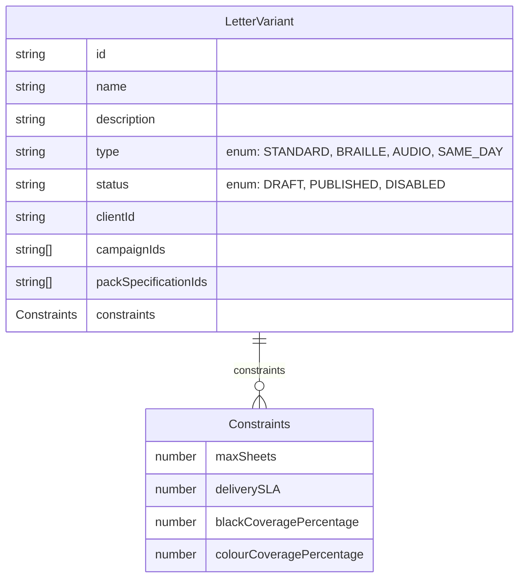
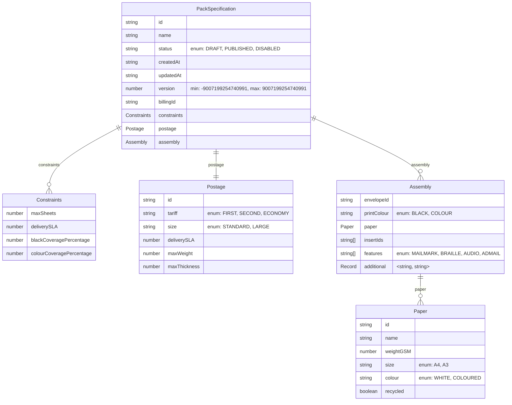

# Event domain ERD

This document contains the mermaid diagrams for the event domain model.

The schemas are generated from Zod definitions and provide a visual representation of the data structure.

## LetterVariant schema

## PackSpecification schema

