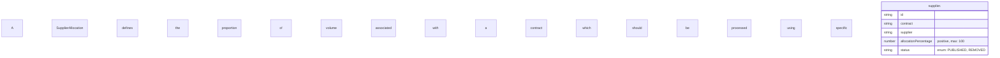
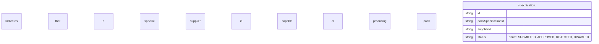

# Event domain ERD

This document contains the mermaid diagrams for the event domain model.

The schemas are generated from Zod definitions and provide a visual representation of the data structure.

## LetterVariant schema

```mermaid
erDiagram
    A Letter Variant describes a letter that can be produced with particular characteristics, and may be scoped to a single clientId and campaignId. {
        string id
        string name
        string description
        string type "enum: STANDARD, BRAILLE, AUDIO, SAME_DAY"
        string status "enum: DRAFT, PUBLISHED, DISABLED"
        string contractId
        string clientId
        string[] campaignIds
        string[] packSpecificationIds
        Constraints constraints
    }
    Constraints {
        number maxSheets
        number deliverySLA
        number blackCoveragePercentage
        number colourCoveragePercentage
    }
    A Letter Variant describes a letter that can be produced with particular characteristics, and may be scoped to a single clientId and campaignId. ||--o{ Constraints : "constraints"
```

## PackSpecification schema

```mermaid
erDiagram
    A PackSpecification defines the composition, postage and assembly attributes for producing a pack. {
        string id
        string name
        string status "enum: DRAFT, PUBLISHED, DISABLED"
        string createdAt
        string updatedAt
        number version "min: -9007199254740991, max: 9007199254740991"
        string billingId
        Constraints constraints
        Postage postage
        Assembly assembly
    }
    Constraints {
        number maxSheets
        number deliverySLA
        number blackCoveragePercentage
        number colourCoveragePercentage
    }
    Postage {
        string id
        string size "enum: STANDARD, LARGE"
        number deliverySLA
        number maxWeight
        number maxThickness
    }
    Assembly {
        string envelopeId
        string printColour "enum: BLACK, COLOUR"
        Paper paper
        string[] insertIds
        string[] features "enum: MAILMARK, BRAILLE, AUDIO, ADMAIL"
        Record additional "&lt;string, string&gt;"
    }
    Paper {
        string id
        string name
        number weightGSM
        string size "enum: A4, A3"
        string colour "enum: WHITE, COLOURED"
        boolean recycled
    }
    A PackSpecification defines the composition, postage and assembly attributes for producing a pack. ||--o{ Constraints : "constraints"
    A PackSpecification defines the composition, postage and assembly attributes for producing a pack. ||--|| Postage : "postage"
    A PackSpecification defines the composition, postage and assembly attributes for producing a pack. ||--o{ Assembly : "assembly"
    Assembly ||--o{ Paper : "paper"
```

## SupplierAllocation schema



## SupplierPack schema


