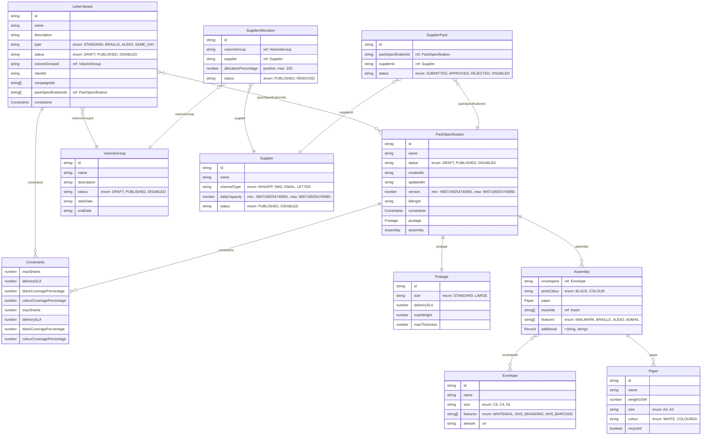

# Event domain ERD

This document contains the mermaid diagrams for the event domain model.

The schemas are generated from Zod definitions and provide a visual representation of the data structure.

## AllSchemas schema

A Letter Variant describes a letter that can be produced with particular characteristics, and may be scoped to a single clientId and campaignId.

## LetterVariant schema

A Letter Variant describes a letter that can be produced with particular characteristics, and may be scoped to a single clientId and campaignId.

## PackSpecification schema

A PackSpecification defines the composition, postage and assembly attributes for producing a pack.

## SupplierAllocation schema

A volume group representing several lots within a competition framework under which suppliers will be allocated capacity.

## SupplierPack schema

Indicates that a supplier is capable of producing a specific pack specification.

